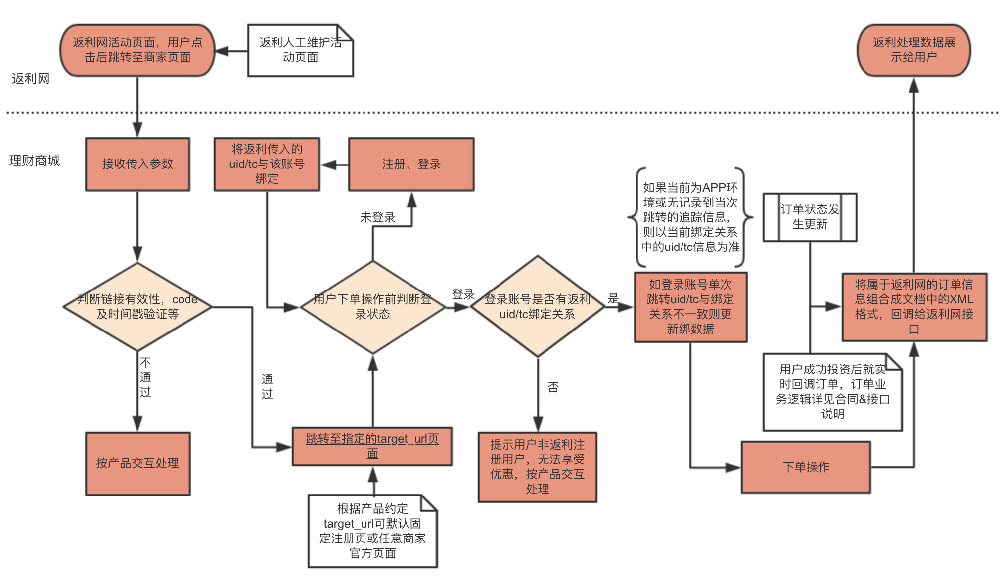

P2P对接文档
======================

基于P2P理财合作的特殊性，在 :doc:`doc` 的基础上，对部分业务逻辑、订单字段做调整。

.. important::
    文档中标记文字为重要或易误解逻辑，请重点关注。

.. _p2p_sp:

特殊逻辑
-----------

.. _p2p_jump:

跳转接口
^^^^^^^^^^

 .. important::
  * P2P理财网站的特殊性，用户跳转注册后，投资行为可能发生在理财APP中，此时订单回传的uid、tc信息为商家记录到的最后一次跳转或注册时的uid、tc信息；如投资发生在PC或H5平台，则仍然按照默认逻辑，返回当次跳转时的跟踪参数；

.. _p2p_order:

订单返回
^^^^^^^^^^

 .. important::

  * 默认约定返利带来的注册用户所有投标均进行推送，商务约定不结佣的新手标、低额标等可以用单独的comm_type进行标识；

  * 返利要求在用户提交投标或支付后即推单，而不可以等到满标/待回款/已回款等状态才推单；如有特例，需双方产品确认；

  * 用户首次投资合作标且投资金额满足合作约定金额，则为 **首投**；若用户首次投资非合作标，不消耗首投资格，如有特例，需双方产品确认。

.. _p2p_order_sample:

订单报文示例
---------------

 .. literalinclude:: /sample/order_p2p.xml
    :language: xml

 .. note::
    * **price/real_pay_fee/coupon** 假设用户投资5000元，使用20元红包，实际支付4980元：
    * 若商务约定不考虑红包，按照金额已满5000元进行结佣，则real_pay_fee=5000；
    * 若商务约定首投/复投结佣金额需扣除红包，按照4980元计算，则real_pay_fee=4980；
    * 上述两种情况，price=5000，coupon=20不变。

.. _p2p_order_param:

订单字段说明
----------------

 =================== ========= ======== ============================================================
 参数名称             类型       要求     说明
 =================== ========= ======== ============================================================
 orders              order     必填      以数组形式存储多个订单order信息
 s_id                int       必填      合作商家在返利网的编号,返利网提供
 order_id            string    必填      订单号，与结算明细中订单号一致
 order_time          datetime  必填      订单创建时间
 uid                 string    必填      跳转接口传入的uid值,原值返回
 tc                  string    必填      跳转接口传入的tc值，原值返回
 status              int       必填      订单状态标识，投资成功必须标为**000**，其他可以自定义，见补充说明
 locked              int       可选      订单状态是否已锁定不可变更(如已过退货期、交易完成不可退货)，默认为0
 lastmod             datetime  必填      订单状态最后一次变更时间，用以保证多次推送时更新逻辑不产生混乱；
 is_newbuyer         int       必填      区分投资情况0：复投；1：首投；2：不确定；
 platform            int       必填      订单产生的平台 1:PC;2:H5;3:APP
 extension           扩展信息   必填      order的扩展信息
 reg_time            datetime  必填      用户注册时间
 mobile              string    必填      用户注册手机号（如不回传需要商务确认）
 user_source         int       必填      用户注册渠道，返利为1;非返利为0
 user_unique_id      string    必填      投资用户在理财商家的uid
 products            product   必填      以数组形式存储多个商品/投标product信息
 pid                 string    必填      投资标的编号
 title               string    必填      投资标的名称
 category            string    必填      投资标的类别编码
 category_title      string    必填      投资标的类别名称
 url                 string    必填      投资标的url
 price               decimal   必填      投资金额,单位元,两位小数；
 real_pay_fee        decimal   必填      结算总金额,单位元,两位小数；计算规则依赖商务合作协议
 commission          decimal   必填      佣金总额，两位小数；商城给返利的费用，金额根据合同定制逻辑计算；
 comm_type           string    必填      佣金分类，见补充说明
 extension           扩展信息   必填      product的扩展信息
 time_limit          int       必填      投资期限，以天为单位，需将月份换算成天数返回。
 annual_yield        decimal   必填      年化收益率，返回小数，保留四位小数0.1200表示年化12%
 coupon              decimal   必填      投标使用的红包或优惠券金额，单位元，两位小数；未使用时为0
 raise_interest      decimal   必填      投标使用的加息，小数格式，0.01表示加息1%；未使用时为0
 payment_type        string    必填      回款方式，如：等额本息，按月付息，一次性还本付息
 payment_time_1      datetime  必填      第一次回款时间(如果有多次自增序列号传递)
 payment_principal_1 decimal   必填      第一次回款本金，单位元，保留两位小数
 payment_interest_1  decimal   必填      第一次回款利息，单位元，保留两位小数
 =================== ========= ======== ============================================================

.. _p2p_order_param_plus:

字段补充说明
-----------------

 1、status：投资完成状态 **000**，定义为商家可以结算佣金的订单，比如说完成撮合、开始计息。其他订单状态值由商家自定义，并在订单报文中准确反馈.同时将状态值列表提供给返利网；且订单状态变更时，要主动回传最新订单内容返利；

 2、佣金分类comm_type： 按照有佣金的订单和无佣金的订单来区分

    * 有佣金的订单：A_3、A_4；A代表类型（建议为标的类型,也可以自行定义），3、4代表用户投资标的月份；
    * 无用佣金的订单统一为：NOCM
    * 如标以上定义无法满足业务需求，由两司产品经理共同商量定义

 3、扩展信息extension：因商家类型不同，针对特殊商家订单报文增加extension 属性。

    * 理财返利需在order节点中返回用户注册时间、注册手机号等信息；
    * 需在product 节点返回理财产品的期限、收益率等属性；
    * 示例中已包含现有常见的扩展信息，如有额外需求，双方技术对接时单独说明。

